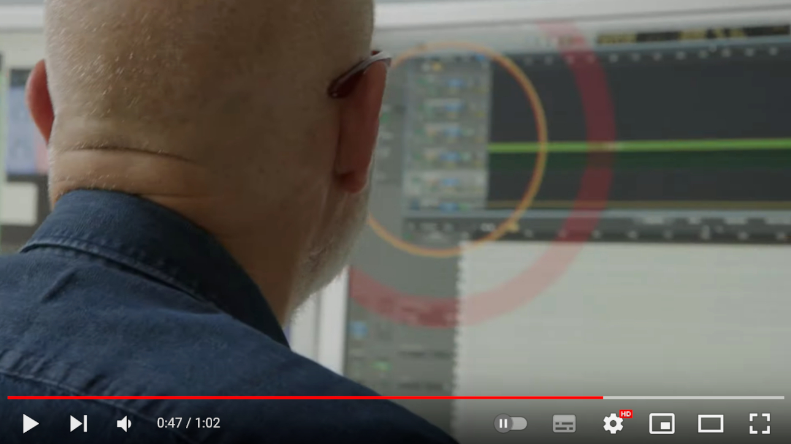

# ◎ Eno Cursor



<small>via: [ENO (2024) Trailer](https://www.youtube.com/watch?v=dAO1sXCUvDM)</small>

*Inspired by Brian Eno's custom cursor from the 2024 documentary 'Eno' by Gary Hustwit*

A gentle Mac app that helps you find your cursor with beautiful, customizable circles. Perfect for elderly users and those with visual impairments.

[](https://ko-fi.com/keartfield)

## Website

https://keartfield.github.io/eno-cursor/

## Project Structure

```
src/
├── main/                   # Electron main process
│   ├── config-loader/      # Configuration management
│   ├── shared/             # Shared constants and utilities
│   └── main.ts             # Main application entry point
├── renderer/               # Renderer processes
│   ├── overlay/            # Cursor overlay window
│   ├── settings/           # Settings window
│   └── shared/             # Shared UI utilities
└── __tests__/              # Integration tests

scripts/                    # Build scripts
tests/                      # Unit tests
```

## Tech Stack

- **Electron**: Desktop app framework
- **TypeScript**: Type-safe JavaScript
- **Vitest**: Testing framework
- **electron-builder**: App packaging and distribution

## Development Setup

1. **Clone the repository**
   ```bash
   git clone https://github.com/keartfield/eno-cursor.git
   cd eno-cursor
   ```

2. **Install dependencies**
   ```bash
   npm install
   ```

3. **Run in development mode**
   ```bash
   npm run dev
   ```

## Build Commands

- `npm run build` - Build the application
- `npm run start` - Build and run the app
- `npm run dev` - Development mode with hot reload
- `npm run test` - Run unit tests
- `npm run dist` - Build distribution packages
- `npm run release` - Build and publish release

## Architecture

The app consists of two main processes:

- **Main Process** (`src/main/`): Manages application lifecycle, creates windows, handles system integration
- **Renderer Processes**: 
  - **Overlay** (`src/renderer/overlay/`): Transparent overlay that follows the cursor
  - **Settings** (`src/renderer/settings/`): Configuration UI

## Contributing

1. Fork the repository
2. Create a feature branch: `git checkout -b feature-name`
3. Make your changes and add tests
4. Run tests: `npm test`
5. Build the app: `npm run build`
6. Submit a pull request

### Commit Message Conventions

Please use the following prefixes for commit messages:

```
add: - New features or functionality
fix: - Bug fixes
mod: - Modifications to existing features
refactor: - Code refactoring without functional changes
test: - Adding or modifying tests
docs: - Documentation changes
build: - Build system changes
website: - Documentation or website updates
chore: - Maintenance tasks (dependencies, config, etc.)
```

## Testing

- Unit tests: `npm test`
- Integration tests are located in `src/__tests__/integration/`
- Test files follow the pattern `*.test.ts`
